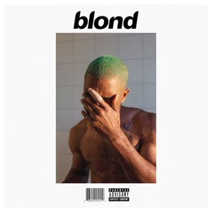
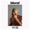
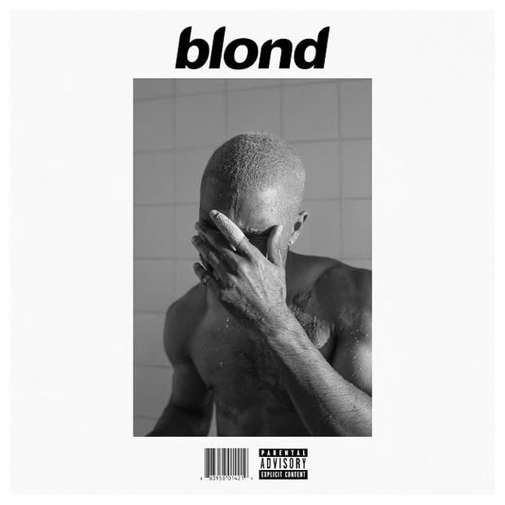

# SCAV-P1

In this README document you'll find the guidelines to the given exercices as well as the pertinent results and comments. For the scripts, the code is explained inside the .py files.

## 1. Start a script called rgb_yuv.py and create a translator from 3 values in RGB into the 3 YUV values, plus the opposite operation.
The upon the execution of rgb_yuv.py, you'll find some terminal propmts to input the type of conversion you want, and consequenlty the values to convert. 

## 2. Use ffmpeg to resize images into lower quality.
For this exercise we chose an image in .jpg format and resized it into multiple scales using ffmpeg. The image chosen is a album cover of 2016 Frank Ocean's *Blond*.  

For each scale we find the following commands using the simple filtergraph `-vf` command: 
- **Half the size**  
We execute `ffmpeg -i b.jpg -vf scale="iw/2:ih/2" resize_half_B.jpg` in the terminal and we go from the original image `b.jpg` weighing 36 KB to the `resize_half_B.jpg` resulting image weighing 8 KB. The resulting image is scaled to half the dimensions both width (`iw`) and height (`ih`).  

- **A third of the size**  
We execute `ffmpeg -i b.jpg -vf scale="iw/3:ih/3" resize_thirds_B.jpg` in the terminal and we go from the original image `b.jpg` weighing 36 KB to the `resize_thirds_B.jpg` resulting image weighing 5 KB. The resulting image is scaled to a third of the dimensions both width (`iw`) and height (`ih`).  

- **A quarter of the size**  
We execute `ffmpeg -i b.jpg -vf scale="iw/4:ih/4" resize_quarter_B.jpg` in the terminal and we go from the original image `b.jpg` weighing 36 KB to the `resize_quarter_B.jpg` resulting image weighing 3 KB. The resulting image is scaled to a quarter of the dimensions both width (`iw`) and height (`ih`).  

- **A tenth of the size**  
We execute `ffmpeg -i b.jpg -vf scale="iw/10:ih/10" resize_tenth_B.jpg` in the terminal and we go from the original image `b.jpg` weighing 36 KB to the `resize_tenth_B.jpg` resulting image weighing 1 KB. The resulting image is scaled to a tenth of the dimensions both width (`iw`) and height (`ih`).  

## 3. Use FFMPEG to transform the image into b/w. Do the hardest compression you can and comment the results
For this exercise we re-used the same image as in exercice 2. To transform the image into a b/w image we eliminated the hue and saturation channels to only have the brightness input, i.e the image in grayscale. We also set a pixel format of 4:2:0 where this type of chroma subsampling is obtained by a 1/4 color resolution, where the color is horizontally and vertically compressed. We execute `ffmpeg -i  b.jpg  -pixel_format yuvj420p -vf hue=s=0 bW.jpg` and obtain the 19KB b/w resulting image.   

## 4. Create a script which contains a function which applies a run-lenght encoding from a series of bytes given.
The script `run_length.py` implements a run-length encoding algorithm where given a sequence of Bytes/Numbers/Letters where every element is separated by an empty space e.g `BB BB BB A A` will output `3BB 2A`. The output indicates (# repetitions)(element1) (# repetitions)(element2) (# repetitions)(element3).

## 5. Create a script which can convert, can decode (or both) an input using the DCT
The `DCT_script.py` implements blockwise DCT compression of our Blond album cover in .png format. When executing the script you will need to input a block size to perform the compression (e.g 8 so as to perform 8x8 compression). To do so, first we perform the 2D dct on each block of the input imag and select how many coefficients we are keeping. Then with our DCT of the image we compute the inverse DCT and obtain the compressed image. The result is the comparison between the original image and the DCT compressed image.
